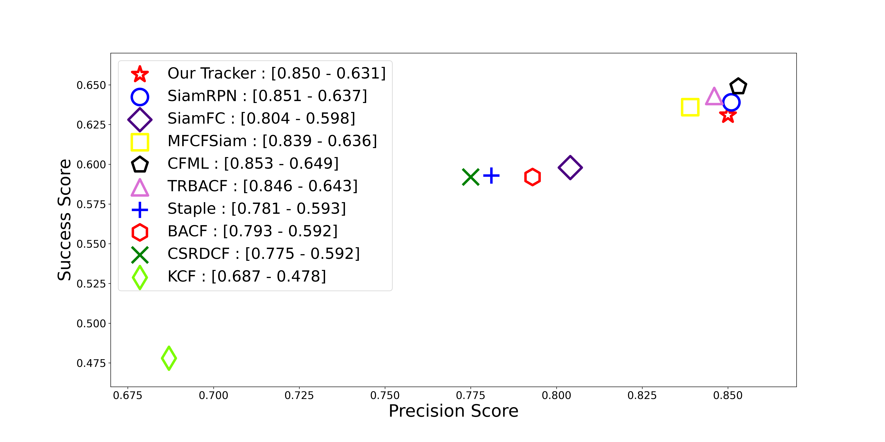

# Combining SiamFC and CF tracker
Implementation of a tracker combining [SiamFC](https://www.robots.ox.ac.uk/~luca/siamese-fc.html) and Correlation Filter based tracker(using [pyCFTrackers](https://github.com/fengyang95/pyCFTrackers)).  

## Framework
  

## Performance
### Benchmark:[OTB2015](http://cvlab.hanyang.ac.kr/tracker_benchmark/index.html)
   
## Requirements
+ Python 3.6+
+ PyTorch 1.7
+ GOT-10k toolkit
+ OpenCV
+ pyCFTrackers


## Install
#### Correlation Filter based tracker
Follow the installation instructions given in [pyCFTrackers](https://github.com/fengyang95/pyCFTrackers).
#### SiamFC
The implementation of SiamFC is based on [siamfc-pytorch](https://github.com/huanglianghua/siamfc-pytorch) and [GOT-10k toolkit](https://github.com/got-10k/toolkit). Follow the installation instructions there and do the following: 
```bash
#install PyTorch 
conda install pytorch torchvision cudatoolkit -c pytorch
#install OpenCV
conda install -c menpo opencv
#install GOT-10k toolkit
pip install got10k
# export path
export PYTHONPATH=$PWD:$PYTHONPATH
```

## Running demo
```bash
python tools/demo.py --trakcer='SiamFC+CF' --data=video_folda
```
The "--tracker" can be selected from "SiamFC", "Staple", and "SiamFC+CF".  
This is a combination of SiamFC and [Staple](https://www.robots.ox.ac.uk/~luca/staple.html).  
By rearranging the code, you can use CF trackers other than Staple in pyCFTrackers.  

## Evaluation in benchmark
```bash
python tools/test.py
```
